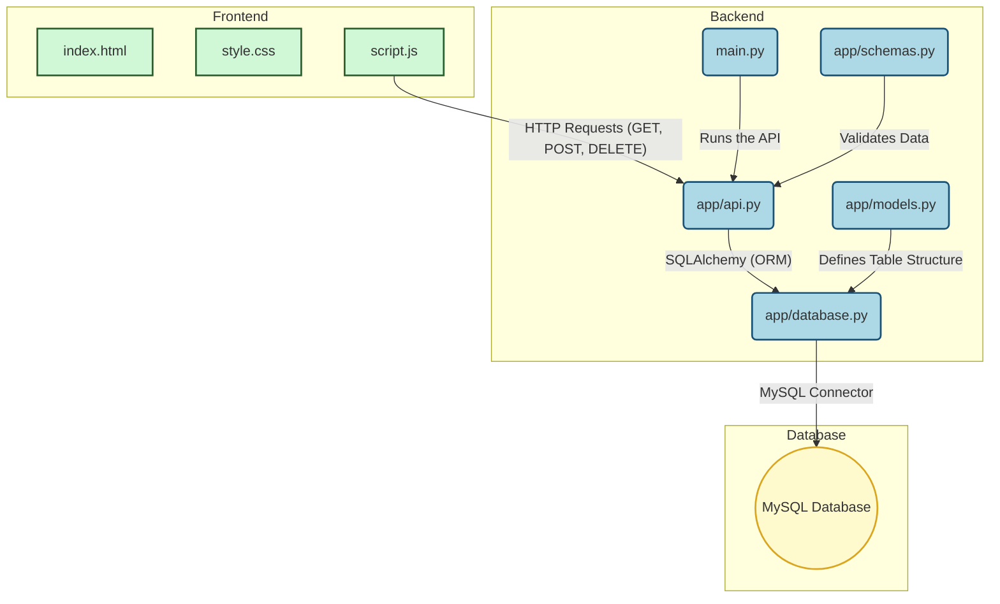

# Full Stack Introduction

This project is an introduction into full stack applications.

There is a frontend, backend and database.

```mermaid
graph TD
    subgraph Frontend
        A[index.html]
        B[style.css]
        C[script.js]
    end

    subgraph Backend
        D(main.py)
        E(app/api.py)
        F(app/database.py)
        G(app/models.py)
        H(app/schemas.py)
    end

    subgraph Database
        I((MySQL Database))
    end

    C -- "HTTP Requests (GET, POST, DELETE)" --> E
    D -- "Runs the API" --> E
    E -- "SQLAlchemy (ORM)" --> F
    F -- "MySQL Connector" --> I
    G -- "Defines Table Structure" --> F
    H -- "Validates Data" --> E

    style A fill:#D0F8D7,stroke:#2C5F2D,stroke-width:2px
    style B fill:#D0F8D7,stroke:#2C5F2D,stroke-width:2px
    style C fill:#D0F8D7,stroke:#2C5F2D,stroke-width:2px

    style D fill:#ADD8E6,stroke:#1A5276,stroke-width:2px
    style E fill:#ADD8E6,stroke:#1A5276,stroke-width:2px
    style F fill:#ADD8E6,stroke:#1A5276,stroke-width:2px
    style G fill:#ADD8E6,stroke:#1A5276,stroke-width:2px
    style H fill:#ADD8E6,stroke:#1A5276,stroke-width:2px

    style I fill:#FFFACD,stroke:#DAA520,stroke-width:2px
```